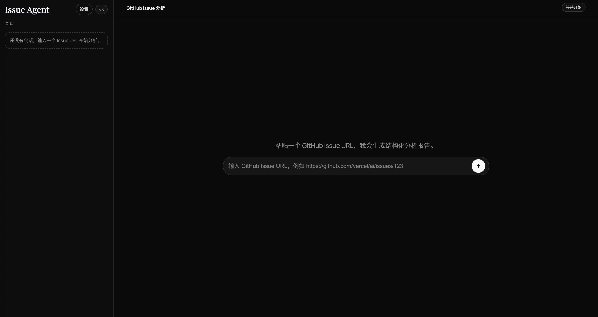

# Issue Agent

一个基于 **Vercel AI SDK** 的 GitHub Issue 分析 Agent。  
输入一个 Issue 链接（或仓库 + 编号），系统会自动拉取 issue / comments / 代码证据，生成可落地的分析报告（Markdown）。




---

## 功能亮点

- **多阶段 Agent 流程**：Issue 理解 → 代码证据检索 → 根因调查 → 执行计划 → 报告汇总
- **代码证据驱动**：通过 GitHub Code Search + 文件内容抓取，让报告尽量基于真实代码上下文
- **实时进度追踪**：前端支持异步运行，`思考过程（可展开）` 中可查看各阶段状态和耗时
- **Markdown 原生报告**：最终直接产出可读 Markdown，不强依赖 JSON 结构化输出
- **Provider 可配置**：支持 OpenAI 兼容接口、`OPENAI_BASE_URL`、`responses/chat` 双模式
- **CLI + Web 双入口**：既可交互式使用，也可脚本化批处理

---

## 架构流程

1. 解析 issue 输入（URL 或 repo + issueNumber）
2. 拉取 issue 与评论
3. 构建模型连接（OpenAI / OpenAI-compatible）
4. 生成 issue 理解与检索关键词
5. 基于关键词做 GitHub 代码检索并抓取文件片段
6. 结合 issue + 代码证据生成根因调查、执行计划
7. 汇总成最终 Markdown 报告，并输出运行 trace

---

## 项目结构

```text
app/
  api/analyze/*            # 同步/异步分析 API
  settings/                # Provider 配置页
  lib/                     # 前端配置与 run-store
src/
  agents/                  # 各阶段 agent
  workflow/                # 主流程编排 analyzeIssue
  lib/github.ts            # GitHub API 封装
  lib/evidence.ts          # 代码证据采集
skills/                    # 提示词技能片段
```

---

## 快速开始

### 1) 安装依赖

```bash
npm install
```

### 2) 配置环境变量

```bash
cp .env.example .env
```

推荐最少配置：

```bash
OPENAI_API_KEY=your_key
GITHUB_TOKEN=your_github_token
OPENAI_API_TYPE=responses   # responses | chat
OPENAI_BASE_URL=            # 可空；兼容网关时填写
OPENAI_ORGANIZATION=
OPENAI_PROJECT=
OPENAI_PROVIDER_NAME=
```

### 3) 启动 Web

```bash
npm run dev
```

打开 [http://localhost:3000](http://localhost:3000)。

- 分析页：`/`
- Provider 设置页：`/settings`

---

## 使用方式

### Web（推荐）

1. 在 `/settings` 配置模型与 GitHub Token（可覆盖服务端 env）
2. 在首页仅输入 Issue URL（模型、API type、语言等均从 settings 读取）
3. 点击 `Run Analysis`
4. 运行中可展开 `思考过程（可展开）` 查看阶段细节
5. 完成后直接查看渲染后的 Markdown 报告

### CLI

```bash
# 用 issue URL
npm run analyze:issue -- \
  --issue-url https://github.com/vercel/ai/issues/123 \
  --lang zh-CN

# 用 repo + issue number
npm run analyze:issue -- \
  --repo vercel/ai \
  --issue-number 123 \
  --lang zh-CN
```

---

## API 说明

### 同步模式

- `POST /api/analyze`
- 请求结束后一次性返回结果

### 实时流式模式（前端默认）

- `POST /api/analyze/stream`：SSE 实时推送阶段事件与报告增量文本

SSE 事件：

- `ready`
- `trace`
- `report-delta`
- `result`
- `error`
- `done`

### 异步模式（兼容保留）

- `POST /api/analyze/start`：启动任务，返回 `runId`
- `GET /api/analyze/status?runId=<id>&after=<n>`：轮询状态与增量 trace

状态值：

- `running`
- `completed`
- `failed`

---

## 输出产物

每次运行都会输出到：

```text
reports/<owner__repo>/issue-<n>/<timestamp>/
```

包含：

- `issue-snapshot.json`
- `issue-understanding.md`
- `code-investigation.md`
- `execution-plan.md`
- `analysis-report.md`（最终报告）
- `analysis-report.json`（元信息 + 报告文本）
- `analysis-trace.json`（阶段追踪）
